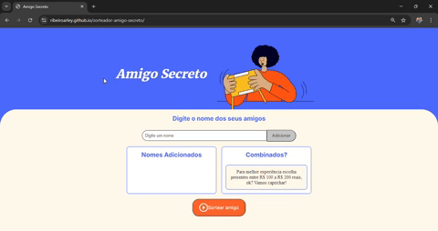

# Amigo Secreto

Bem-vindo ao **Amigo Secreto**, uma aplicação web simples e divertida para organizar sorteios de amigo secreto entre amigos ou familiares!

Bem-vindo ao **Amigo Secreto**, uma aplicação web simples e divertida para organizar sorteios de amigo secreto entre amigos ou familiares! Com uma interface amigável e estilizada, você pode adicionar nomes, realizar o sorteio e garantir que todos saibam quem tiraram de forma prática e divertida.

## Sorteador de Amigo Secreto 🎉
Você pode adicionar nomes de amigos à lista e sortear um nome aleatório para realizar o tradicional "Amigo Secreto". Além disso, o sistema garante que cada amigo seja sorteado apenas uma vez, mantendo a surpresa!

## Demonstração

## Funcionalidades 🛠️
Adicionar nomes de amigos: Insira os nomes de seus amigos e adicione-os à lista de sorteio.
Sortear um nome aleatório: Realize o sorteio e descubra qual amigo ficou com você!
Evitar repetições: O sistema garante que um nome não seja sorteado mais de uma vez.
Interface simples e intuitiva: A interação é fácil e permite adicionar novos amigos rapidamente.

## Tecnologias Utilizadas 🖥️
HTML
CSS
JavaScript

## Exemplo de uso:
Adicione alguns nomes de amigos.
Clique em "Sortear amigo" para descobrir quem é o sorteado! 🎉

## Acesse o Projeto 🌐
Se preferir, você pode acessar o projeto online através deste link:

https://ribeiroarley.github.io/sorteador-amigo-secreto/

# Desenvolvido por 💼
Arley Ribeiro da Silva Xavier

# Agradecimentos
Gostaria de agradecer ao programa ONE - Oracle Next Education em parceria com a Alura pela oportunidade de aprendizado.
Esta formação foi uma etapa importante no meu desenvolvimento como programador, e estou muito grato por fazer parte dessa jornada.
Agradeço também ao time da Alura, aos mentores e a todos os colegas de aprendizagem que tornaram essa experiência ainda mais enriquecedora.